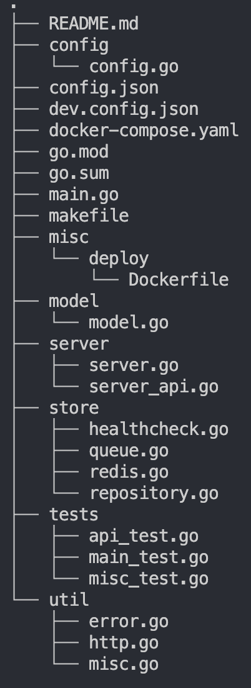

## FIFO-queue

The service stores the messages in application memory and in redis. The order for message queue is `first in first out`: [description](https://www.investopedia.com/terms/f/fifo.asp)

## Dependencies

* Go(v1.19):
  * [Golang website](https://golang.org)
  * `brew install go`
* Redis:
  * [Redis docs](https://redis.io/docs/)
  * `brew install redis`
* Golang libraries:
  * Gin [v1.8.2](https://github.com/gin-gonic/gin) has a logger and recover under hood
* Testing:
  * Miniredis [v2.30.0](https://github.com/alicebob/miniredis) used for mocking a redis connection
  * run tests via `make test`

## The docker compose

Simply run the application and redis with `config.json`:

```sh
make docker-up

or in detached mode

make docker-up-d
```

## Local development

The `dev.config.json` file is used for the local development.

```sh
make run
```

## Build a project

```sh
make build

make run-b
```

The build uses the develop config file, for the deploy the config environment variables in the `config.json` file should be changed.

## The main API Behavior

* The service stores messages in redis linked list, if redis is not available, `healthCheck` handles it and counts maximum retries. Also service stores data in application memory.
* After the `healthCheck` marks that redis is not alive, it checks in background with timeout the connection again and after redis restored it refreshes it. While redis is down, the service stores data `in memory`.
* When redis becomes alive, service sync up data between application cache and redis.

## The implementation

### The project structure



### The testing

The tests can be executed with command:

```sh
make test
```

To run a specific test case:

```sh
make test-r run=TestApiMsg
```

Tests creates a mock API server with all routes.

Caution: Tests requires a redis connection. The main approach is to init a mini redis connection and verify all endpoints and data are stored correctly. The original data in the redis will not be manipulated.